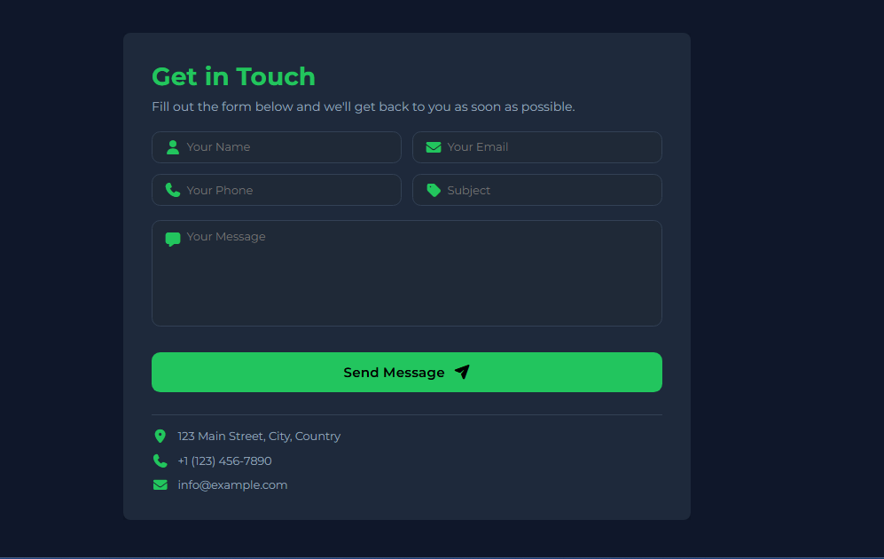

# 📬 Contact Form Project

A modern and responsive Contact Form built using HTML and CSS only.  
This project is part of my beginner frontend development practice to improve UI design skills and Git workflow.

---

## 🌐 Live Demo

🚀 Experience the project live here:  
[👉 Open Contact Form](https://habibtamkinfx.github.io/contact-form/)

---

## 👨‍💻 Author

**GitHub:** [habibtamkinfx](https://github.com/habibtamkinfx)

---

## 🚀 Features

- Clean and modern dark UI design
- Fully responsive layout (mobile friendly)
- Smooth fade-in animation
- Font Awesome icons integration
- CSS Grid layout for input fields
- Hover effects and interactive button styling
- No JavaScript (pure HTML & CSS)

---

## 🛠️ Technologies Used

- HTML5
- CSS3
- Google Fonts (Montserrat)
- Font Awesome Icons

---

## 📁 Project Structure

contact-form/
│
├── index.html  
├── style.css  
├── assets/
│ └── screenshot.png  
└── README.md

---

## 🎯 Purpose of This Project

This project was built for learning and practice purposes, including:

- Structuring semantic HTML forms
- Designing modern UI with CSS
- Using CSS variables for theming
- Creating responsive layouts
- Improving Git commit workflow

---

## 📸 Preview

## 

## 🧠 What I Learned

- How to build a clean contact form UI
- Using CSS Grid and Flexbox effectively
- Working with CSS variables for theme control
- Adding smooth animations with CSS
- Writing clean and meaningful Git commits

---

## 📌 How to Run This Project

1. Clone the repository:

```bash
git clone https://github.com/habibtamkinfx/contact-form.git
```
